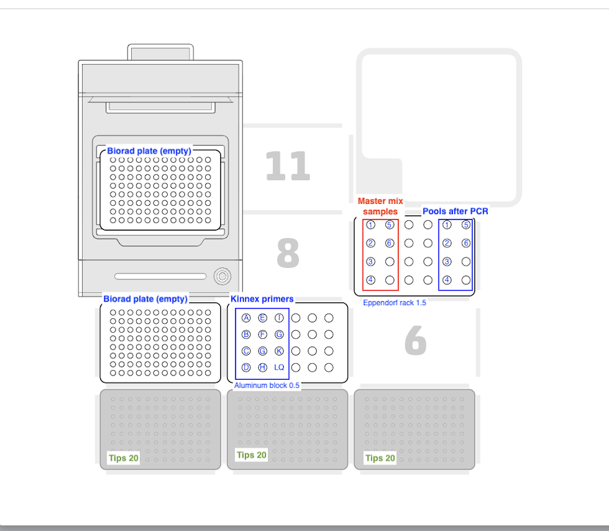

# Shiny app to setup PacBio Kinnex protocols on Opentrons OT2

This Shiny app is used to prepare [Opentrons OT2](https://opentrons.com/products/robots/ot-2/) protocols for the [PacBio Kinnex applications](https://www.pacb.com/technology/kinnex/) 16S rRNA, full length RNA and single-cell RNA. After selecting the protocol and adjusting the parameters, the generated python script can be downloaded and used on the OT2. The Opentrons robot has a single channel GEN2 pipette on the left mount, a 8-channel GEN2 pipette on the right mount and a thermocycler module. The deck layout used for all protocols:

 

### Running the app
You can try all the functions of the app <a href="http://161.35.69.97:3838/kinnex-ot2/" target="_blank">here</a>

### Deployment
If you want to deploy the Shiny app on your Shiny server or your local machine:

```bash
git clone https://github.com/angelovangel/kinnex-ot2.git
# change in the kinnex-ot2 directory and start R
R
# in R, renv() will bootsatrap itself and install all dependencies

``` 
You can check how to deploy and run Shiny apps [here](https://shiny.posit.co/r/deploy.html).
### Disclaimer
The author is not affiliated with PacBio or Opentrons.